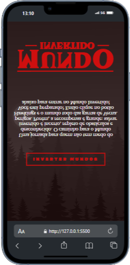

# Mundo Invertido - Landing Page

Bem-vindo à landing page **Mundo Invertido**, um projeto dinâmico e interativo inspirado em universos fantásticos. Esta página foi desenvolvida para oferecer uma experiência única com **formulários de inscrição**, **temas dinâmicos com música**, e um design **totalmente responsivo para dispositivos móveis**.

---

## 📑 Sumário

- [Sobre o Projeto](#sobre-o-projeto)
- [Funcionalidades](#funcionalidades)
- [Demonstração](#demonstração)
- [Instalação](#instalação)
- [Como Usar](#como-usar)
- [Tecnologias Utilizadas](#tecnologias-utilizadas)
- [Contribuição](#contribuição)
- [Licença](#licença)

---

## 📝 Sobre o Projeto

A **Mundo Invertido** é uma landing page projetada para oferecer aos usuários uma experiência imersiva. Com elementos interativos e visuais impactantes, a página permite que os visitantes explorem um universo criativo, se inscrevam em eventos ou serviços e personalizem sua navegação com temas musicais.

---

## ✨ Funcionalidades

- **Formulário de Inscrição**: Uma interface simples e funcional para capturar dados dos usuários.
- **Temas Dinâmicos**: Alteração de cores, estilos e músicas que se ajustam ao tema escolhido pelo visitante.
- **Responsividade Mobile**: Layout otimizado para dispositivos móveis e tablets, garantindo acessibilidade em qualquer tela.
- **Interatividade Musical**: Música de fundo sincronizada com o tema escolhido.
- **Design Atraente**: Um visual moderno, inspirado em universos fictícios.

---

## 📸 Demonstração


.png)


---

## ⚙️ Instalação

Siga os passos abaixo para rodar o projeto localmente:

1. Clone este repositório:
2. ```
   git clone https://github.com/seu-usuario/mundo-invertido.git
   ```
3. Navegue até o diretório do projeto:
   ```
   cd mundo-invertido
   ```
5. Abra o arquivo `index.html` em seu navegador.

---

## 🚀 Como Usar

1. Acesse a página inicial e escolha um tema dinâmico.
2. Preencha o formulário de inscrição com seus dados.
3. Explore os temas musicais e as mudanças visuais enquanto navega.

---

## 🛠️ Tecnologias Utilizadas

- **HTML5**: Estruturação do conteúdo.
- **CSS3**: Estilização, responsividade e animações.
- **JavaScript**: Funcionalidades dinâmicas, temas e interatividade.

---

## 🤝 Contribuição

Contribuições são bem-vindas! Siga os passos abaixo:

1. Faça um fork deste repositório.
2. Crie um branch para sua feature (`git checkout -b minha-feature`).
3. Commit suas mudanças (`git commit -m 'Adiciona nova feature'`).
4. Envie para o branch principal (`git push origin minha-feature`).
5. Abra um Pull Request.

---

## 📜 Licença

Este projeto está sob a licença [MIT](https://opensource.org/licenses/MIT). Sinta-se à vontade para usá-lo e modificá
